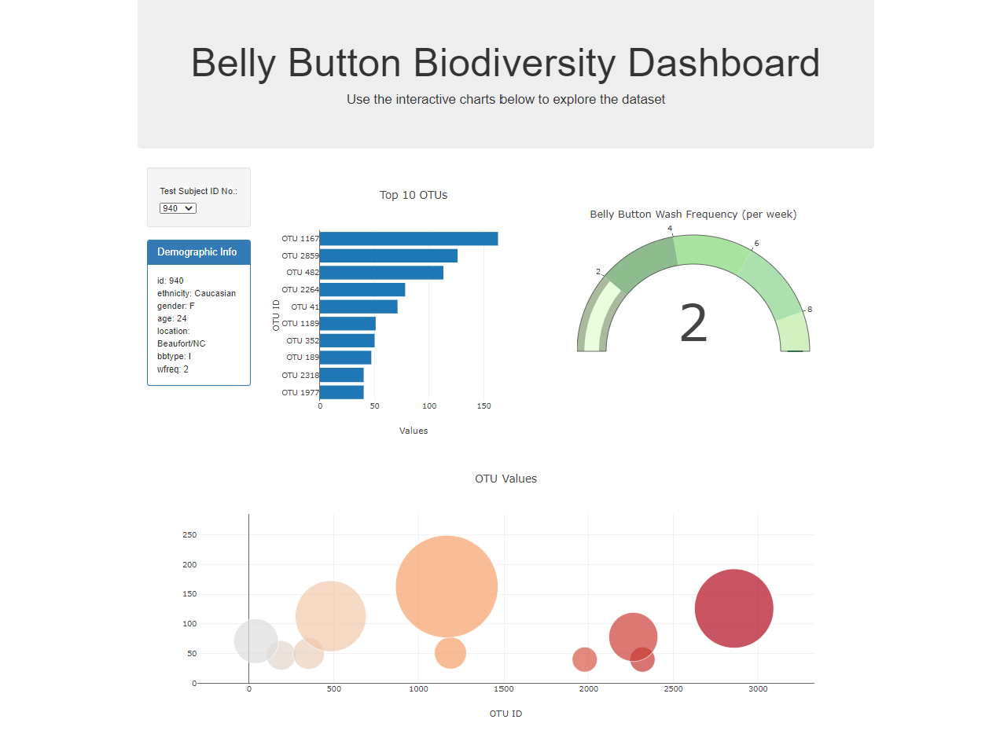

# plotly-challenge - Belly Button Biodiversity

#### A whole other look at the world living in your belly button, literally!

In this assignment, we built an interactive dashboard to explore the [Belly Button Biodiversity dataset](http://robdunnlab.com/projects/belly-button-biodiversity/), which catalogs the microbes that colonize human navels.

The dataset reveals that a small handful of microbial species (also called operational taxonomic units, or OTUs, in the study) were present in more than 70% of people, while the rest were relatively rare.

The following details the dashboard, visualizations, and files related to this project:

### Dashboard

* The Dashboard allows you to select from the dropdown menu from all the Test Subjects from the samples.json data, which may be referenced in the data folder.
* The HTML page features the following visualizations:

### Visualizations

* Demographic Info table lists out the selected Test Subject's demographic information
* Top 10 OTU bar chart displays the top 10 OTU Values for the selected Test Subject.
* Belly Buttom Wash Frequency is a gauge table that displays the selected Test Subject's belly button wash frequency and can be used to compare to the range of the sample population. The range from the gauge is based on the sample.json data's maximum Wash Frequency.
* The scatter plot depicts all of the OTUs found from the selected Test Subject, with bubble markers scaled from the amount of OTUs found.

Script to visualizations can be references in the app.js file under the static/js folder.

### About the Data

Hulcr, J. et al.(2012) _A Jungle in There: Bacteria in Belly Buttons are Highly Diverse, but Predictable_. Retrieved from: [http://robdunnlab.com/projects/belly-button-biodiversity/results-and-data/](http://robdunnlab.com/projects/belly-button-biodiversity/results-and-data/)

- 

Interact with the Dashboard! Maybe you'll find a test subject with similar demographics to find what microbial species is living in your belly button right now!

